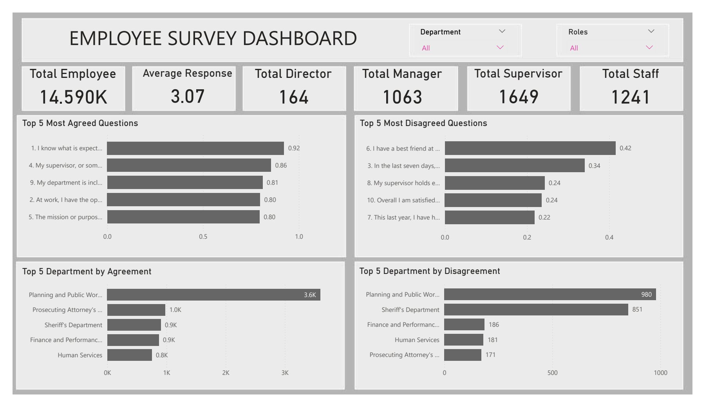
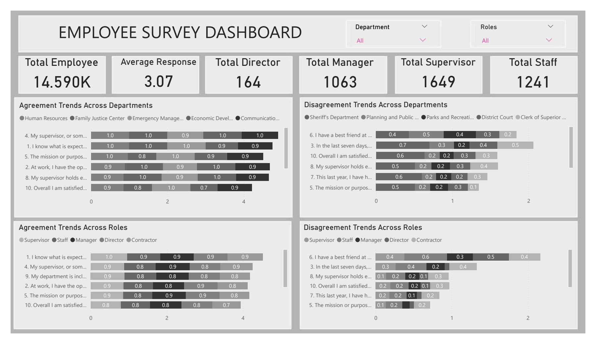
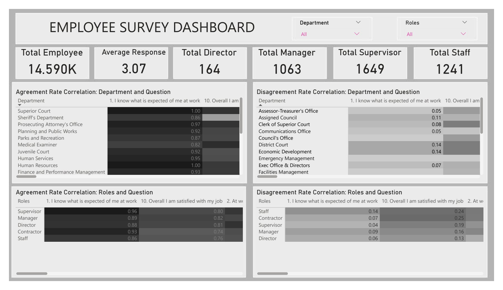

# Employee-Survey

## Introduction

Pierce County WA conducted an employee engagement survey of government employees. It contains the responses from them and I analyzed the dataset to draw insights, understand the challenges faced by these employees and help to make good decisions based on these insights.

## Power BI Concepts applied:
- DAX
- Conditional Column
- Merged Column
- Filters
  
## Problem Statement

- Which survey questions did respondents agree with or disagree with most?
- Do you see any patterns or trends by department or role?
- As an employer, what steps might you take to improve employee satisfaction based on the survey results?

## Data Cleaning

- I cleaned this dataset using Power Query in Power BI.
- I changed some of the data types of the columns.
- I filtered out all the null responses.
- I ensured the questions were uniform by trimming them and replacing the values from ‘&’ to ‘and’.
- I merged columns of all employees to roles numbers.
- Then, I added a conditional column to change role numbers to roles.
- For the ones who answered the questions but were not managers, supervisors, directors or staff, I called them contractors.

## Data Analysis

### 1. Agreements Rates

- From  the visualization, we can see that we had a total of about 15,000 employees, comprising 164 directors, 1063 managers, 1649 supervisors and 1241 staff. 
- The top most agreed question is ‘I know what is expected of me at work.’ 92.62% of employees know what is expected of them. Then, 86.41% agree that they have a supervisor or any one at the workplace who cares about them. 
- The top most disagree question is ‘I have a best friend at work’. 42% of employees do not have any best friend at work place, then 34% of people had not received any recognition or praise for doing good work in the last seven days.
- The Planning and Public Works Department had the most people who agreed with the questions. Ironically, they also had the most people who disagreed with the questions.

### 2. Trends Across Departments and Roles

- Across the top 5 departments by agreement rate, the most agreed question is whether supervisors or someone cares about them.The second most agreed question is ‘they know what is expected of them.’
- Also, across roles by agreement rate, the most agreed question is ‘they know what is expected of them’.The second most agreed question is ‘supervisors or someone cares about them’. This shows that regardless of the roles or department, most people know their roles and have people who care about them.
- Also, the top most disagree questions are ‘I have a best friend at work’ and ‘they had not received any recognition or praise for doing good work in the last seven days.’

### 3. Agreement and Disagreement Role/Department Correlation

- Some departments such as the superior court, sheriff’s department, prosecuting attorney’s office, planning and public works and other departments all had high agreement rates.
- Meanwhile, some departments such as the assessor-treasury office, assigned council, clerk of superior court, communications office and council’s office and other departments all had high disagreement rates. 
- The supervisor and the directors had the highest agreement rate while the staff had the highest disagreement rates.

### 4. Insights/Actions
I would advise that the departments with the top disagreement rates should be analyzed further to know why they do not agree with the questions.
Also, the supervisors should offer more supporting hands, complimenting good works regularly(once in a week).
The supervisors should be compensated, additional pay or benefits to aid them continually do their best.
Much attention should be paid to staff. There should be additional training, possible ways to express their displeasure and an ever friendly supervisor.
I would advise that there are fun sections too, in the company allowing a friendly relationship to develop amongst colleagues.

## 4. Conclusion
The Survey had a high agreement rate. Most employees agreed with the questions, and they knew their roles. The top disagreed question was 42%, showing that the agreement rate was even higher in the most disagreed question.
